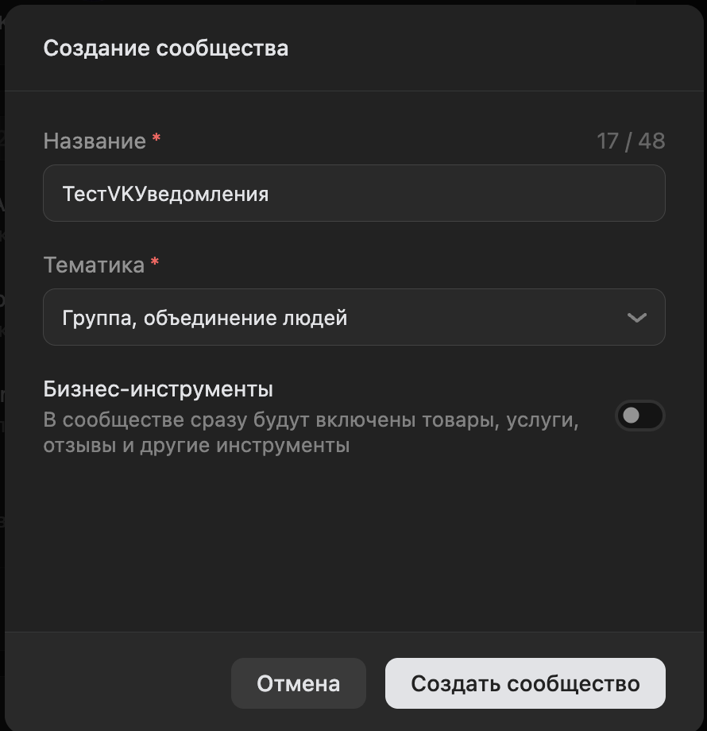
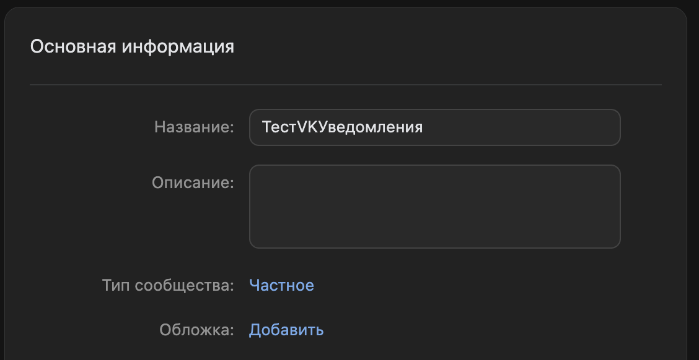
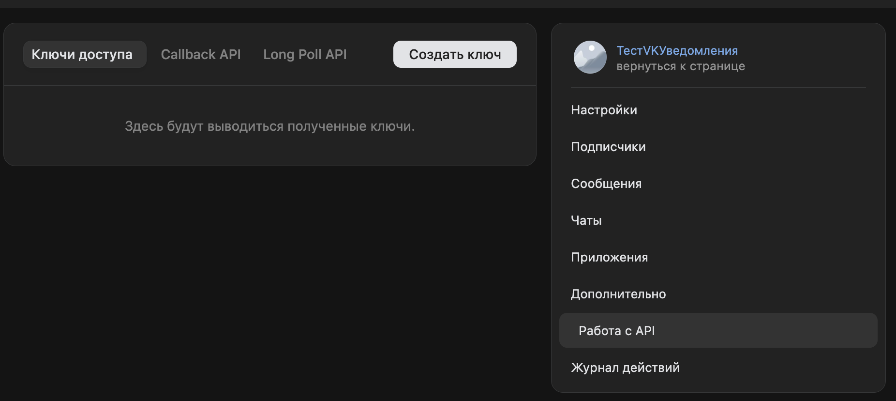
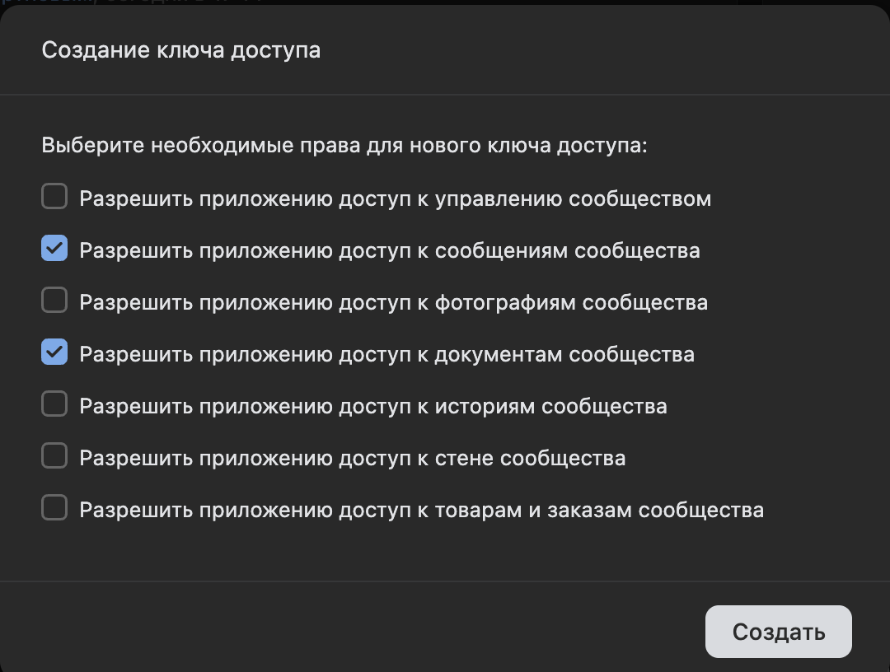
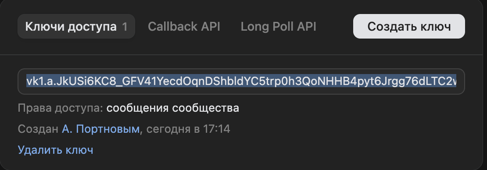
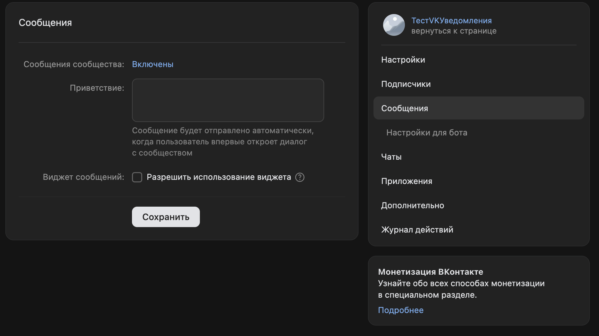
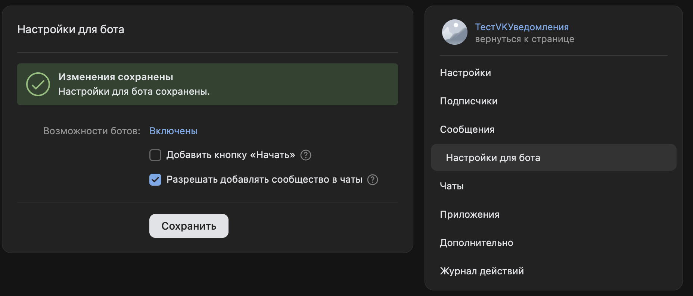
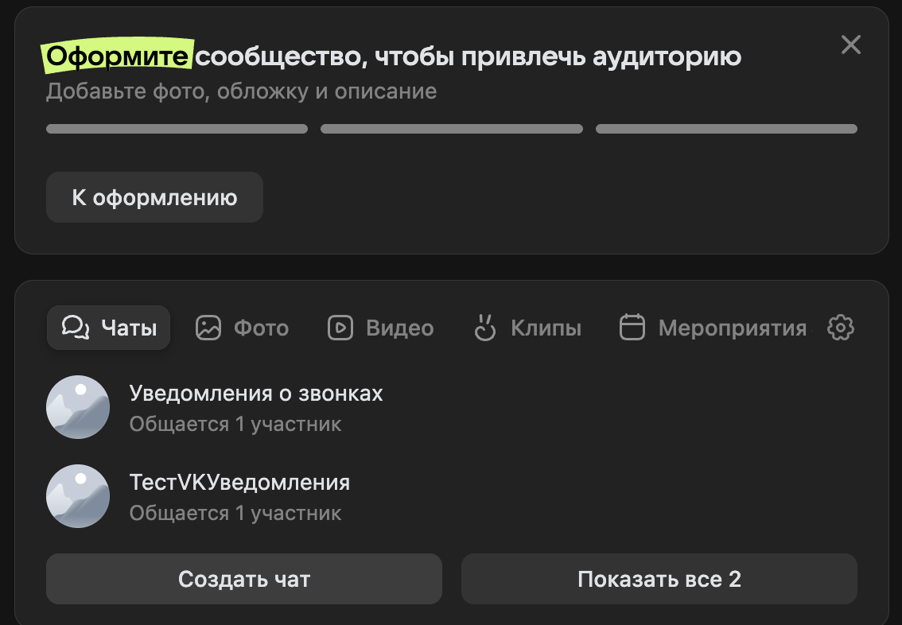
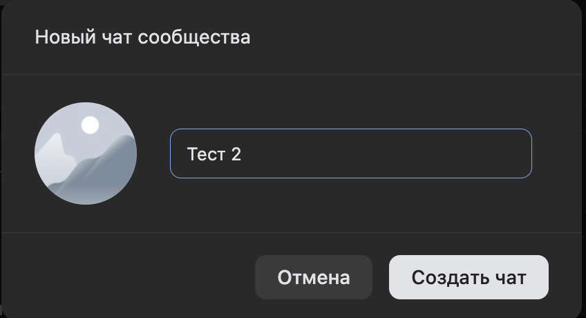
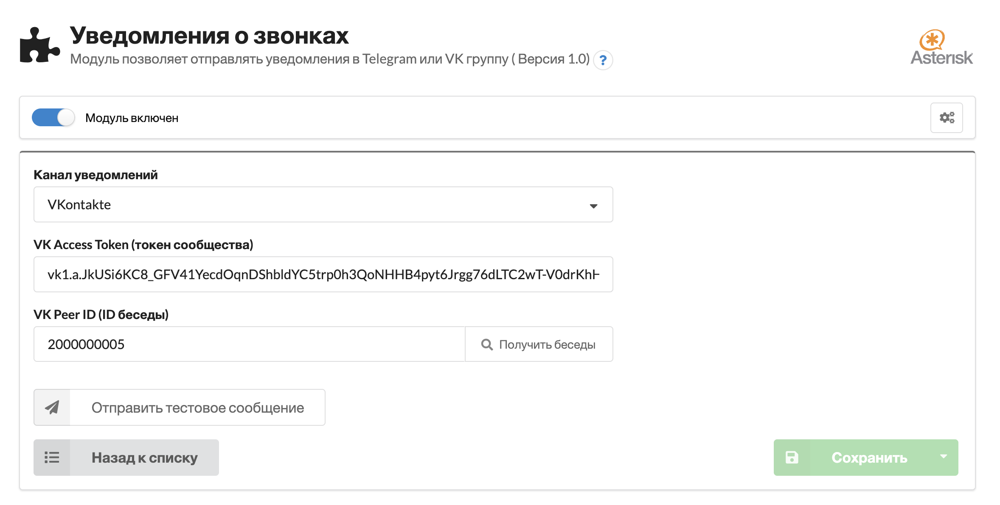

# ModuleNotifier - Уведомления о звонках для MikoPBX

*Read this in other languages: [English](README.md), [Русский](readme.ru.md).*

Модуль для отправки уведомлений о звонках в групповые чаты **Telegram** или **ВКонтакте**. Отслеживает входящие/исходящие вызовы и отправляет форматированные сообщения с записями разговоров в виде голосовых сообщений.

## Возможности

- Уведомления о звонках в реальном времени (входящие, исходящие, пропущенные)
- Отправка записей разговоров как голосовых сообщений (OGG)
- Редактирование сообщений с обновлением статуса звонка
- Поддержка Telegram и ВКонтакте
- Автоматическое получение списка бесед VK через API
- Отправка тестового сообщения из веб-интерфейса
- Форматирование номеров телефонов (+7XXXXXXXXXX)

## Настройка - Telegram

1. Создайте бота через [@BotFather](https://t.me/BotFather)
2. Скопируйте токен бота
3. Добавьте бота в групповой чат и получите chat ID
4. В настройках модуля MikoPBX: выберите **Telegram**, укажите токен и chat ID
5. Нажмите **Отправить тестовое сообщение** для проверки

## Настройка - ВКонтакте

### 1. Создайте сообщество VK

Настройте тип сообщества:

### 2. Создайте ключ доступа API

Перейдите в **Управление** > **Настройки** > **Работа с API** > **Ключи доступа** > **Создать ключ**

Обязательно включите право **Сообщения сообщества** (messages):

Скопируйте полученный токен:

### 3. Включите сообщения сообщества

Перейдите в **Управление** > **Сообщения** > включите **Сообщения сообщества**

Без этого API будет возвращать ошибку при попытке отправки.

### 4. Разрешите добавление в беседы

Перейдите в **Сообщения сообщества** > **Настройки бота** > включите **Разрешить добавление в беседы**

### 5. Создайте чат сообщества

Используйте действие **Создать чат**:

Кликните по чату и присоединитесь к нему. В настройках чата можно добавить участников.

### 6. Настройте модуль MikoPBX

- Выберите канал уведомлений **VKontakte**
- Укажите токен
- Нажмите **Получить беседы**
- Выберите беседу из списка
- Нажмите **Отправить тестовое сообщение**
- Сохраните настройки

## Вопросы

Подключайтесь к каналу для разработчиков в Telegram [@mikopbx_dev](https://t.me/joinchat/AAPn5xSqZIpQnNnCAa3bBw)
